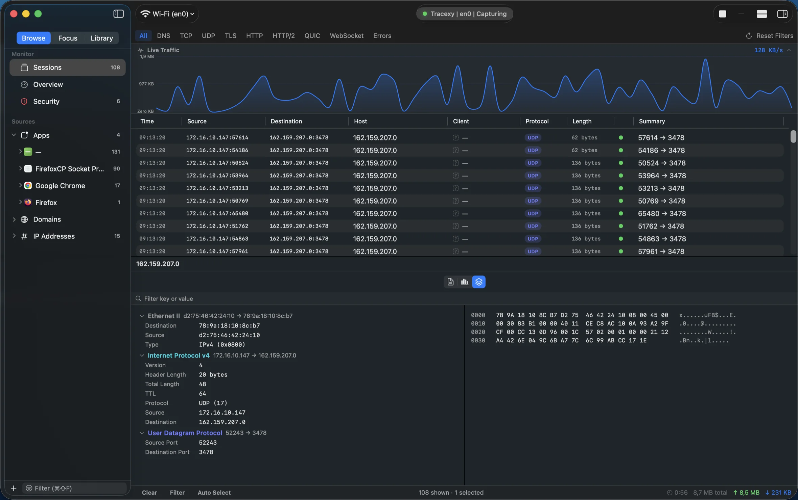
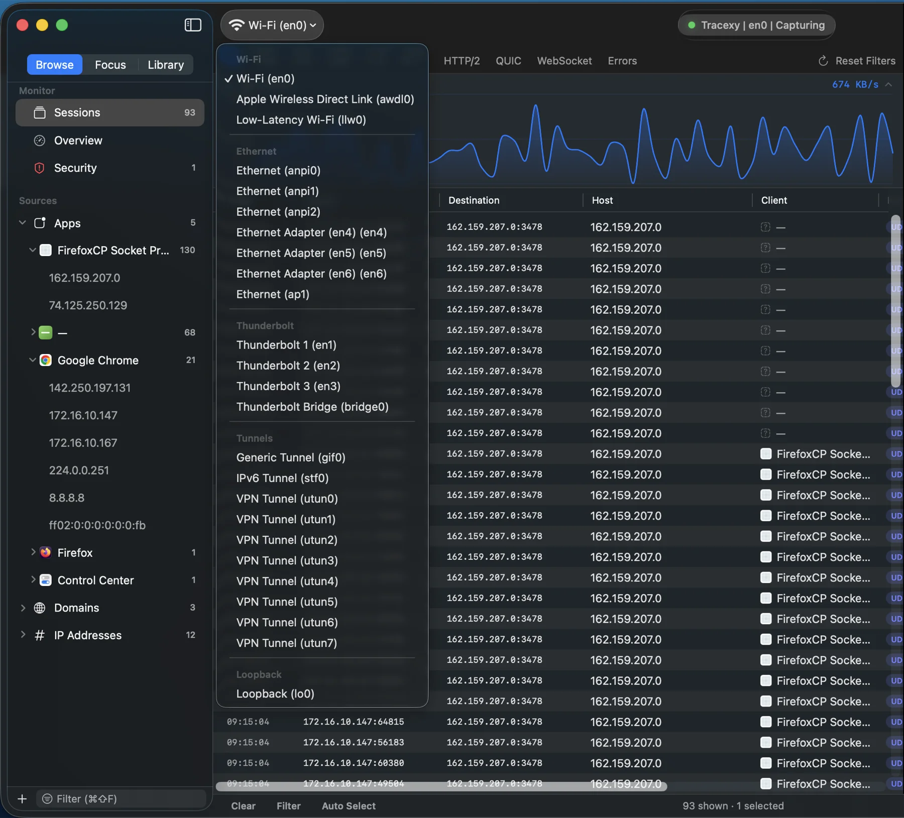
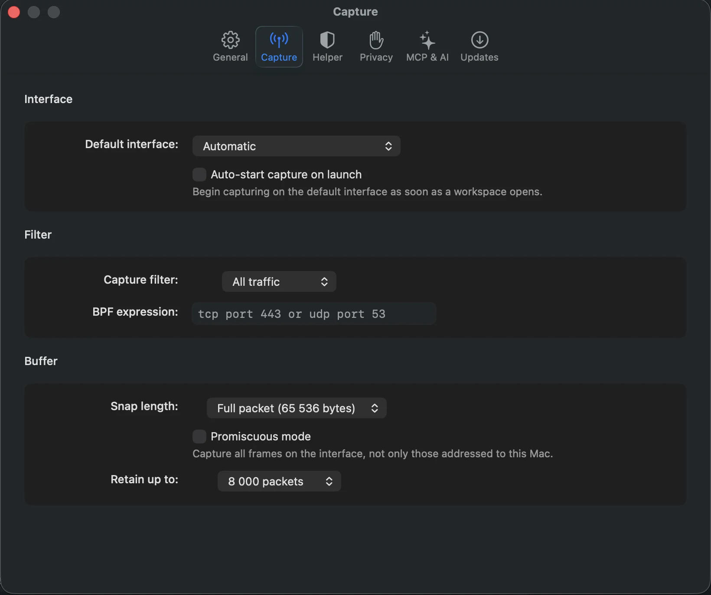
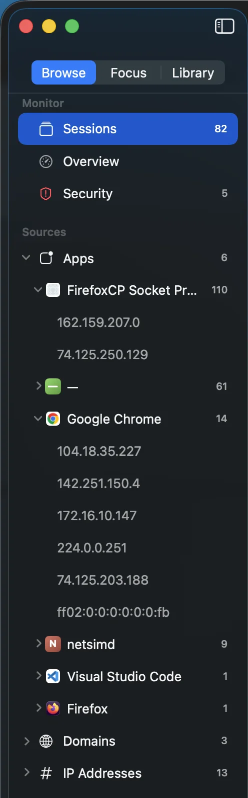
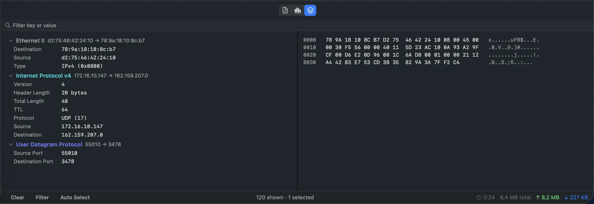

<p align="center">
  
</p>

<h1 align="center">Tracexy</h1>

<p align="center">
  <strong>Native macOS network intelligence, organized around sessions—not packet noise.</strong>
</p>

<p align="center">
  Capture live traffic or open a saved capture, then investigate hosts, processes, protocols,
  timing, and raw packet evidence in one local-first workspace.
</p>

<p align="center">
  <a href="https://github.com/RockxyApp/Tracexy/actions/workflows/build.yml"></a>
  
  
  
  <a href="LICENSE"></a>
  <a href="CONTRIBUTING.md"></a>
</p>

---

Tracexy is an open-source network intelligence app built specifically for macOS. It captures traffic
passively and turns frames into explainable sessions and correlated activities: which process
contacted which host, which protocols appeared, how much data moved, and what evidence supports the
grouping.

The main experience is session-first. Raw protocol fields and hex remain one click away when the
bytes are the answer, but they do not dominate the workspace.

> [!IMPORTANT]
> Tracexy is under active MVP development. Live capture, capture-file IO, bounds-checked decoding,
> session grouping, filtering, correlation, and the native investigation workspace are implemented
> and tested. Stateful reassembly, persistent storage, deeper analysis, enforced export redaction,
> and AI/MCP integration remain future work.

## See Tracexy in action

<p align="center">
  <a href="https://rockxy.io/tracexy#demo">
    
  </a>
</p>

<p align="center">
  <em>From live capture to explainable sessions and packet-level evidence.</em>
</p>

<p align="center">
  
</p>
<p align="center"><em>Choose the interface and start from the traffic surface that matters.</em></p>

<p align="center">
  
</p>
<p align="center"><em>Control capture scope, filters, packet detail, and retention before traffic leaves the wire.</em></p>

<p align="center">
  
</p>
<p align="center"><em>Navigate from applications to domains and IP addresses without losing the session context.</em></p>

<p align="center">
  
</p>
<p align="center"><em>Inspect decoded protocol fields alongside the raw bytes that support them.</em></p>

<p align="center">
  <a href="https://rockxy.io/tracexy#demo">Watch the full 45-second walkthrough on Rockxy Web →</a>
</p>

## Why Tracexy

- **Sessions before packets.** Bidirectional traffic is grouped by canonical five-tuple so one
  conversation stays together.
- **Explainable correlation.** Related DNS, TCP, TLS, and HTTP observations can be grouped into an
  activity with visible confidence and contested-attribution states.
- **Native investigation workflow.** The app uses SwiftUI and AppKit for a real macOS sidebar,
  table, toolbar, split views, inspectors, menus, keyboard behavior, and SF Symbols.
- **Evidence stays available.** Summaries lead to decoded layers, field ranges, and raw hex without
  leaving the selected session.
- **Honest unknowns.** Missing process, hostname, protocol, or timing evidence is shown as unknown;
  Tracexy does not manufacture telemetry.
- **Local-first by design.** Captured frames and derived session data stay on the Mac unless the
  user explicitly exports a capture.

## What works today

| Area | Available now |
|---|---|
| **Capture** | Live libpcap capture through a privileged helper; interface discovery; bounded frame buffering; classic PCAP read/write; PCAPNG read |
| **Decode** | Ethernet, loopback and tunnel framing; ARP; IPv4/IPv6; ICMP/ICMPv6; TCP/UDP; DNS, TLS, HTTP/1, and QUIC summaries |
| **Sessions** | Direction-normalized five-tuple grouping, byte and timing summaries, status derivation, and higher-level activity correlation |
| **Investigation** | Overview, session table, flow map, scoped search, structured filters, grouping, context menus, decoded fields, and hex evidence |
| **Workspace** | Native sidebar, independent workspace tabs, vertical or bottom inspector layouts, status/footer surfaces, Focus Sets, and Noise Control |
| **Attribution** | Best-effort process ownership from `pktap` metadata with a local socket-to-process fallback |

## Protocol coverage

Application-layer decoding is intentionally summary-level in the current MVP. It identifies a
conversation from data visible in an individual frame; it does not reconstruct an encrypted or
segmented stream.

| Layer | Coverage | Important limits |
|---|---|---|
| **Link / network** | Ethernet II, BSD loopback/null, raw/tunnel IP, ARP, IPv4 options, IPv6 extension headers, ICMP/ICMPv6 | Partial decode is returned for malformed or truncated input |
| **Transport** | TCP flags and common option TLVs; UDP endpoints | No TCP stream reassembly |
| **DNS** | Questions, compression pointers, and common answer records including A, AAAA, CNAME, MX, TXT, SRV, and SOA | No DNSSEC analysis |
| **TLS** | Record and handshake metadata, offered/chosen versions, cipher information, SNI, and ALPN | No decryption, certificates, or application data |
| **HTTP/1** | Request-line recognition and the `Host` header | No full headers, response parsing, bodies, chunking, or decompression |
| **QUIC** | Long-header identification on UDP/443 | No frame or payload decode |

See the [source-grounded protocol matrix](docs/protocol-support.md) for exact field coverage.

## Current boundaries

These are deliberate statements of present capability, not hidden roadmap promises:

- No TLS or QUIC decryption.
- No TCP reassembly or stateful connection engine.
- No deep HTTP/2, HTTP/3, or WebSocket decoder.
- No persistent capture database.
- No durable security-analysis engine.
- No MCP or AI data path.
- Privacy preferences for redaction, IP masking, credential stripping, and retention are stored, but
  the export-redaction and auto-clear pipelines that would enforce them are not implemented yet.

## Privacy and security

Network captures can contain credentials, private hostnames, personal messages, and application
payloads. Tracexy treats them as sensitive by default.

- Captured traffic and derived sessions remain local; Tracexy does not upload capture payloads.
- Live capture starts when the user presses **Start**. If the user explicitly enables
  **Auto-start capture on launch**, that preference starts capture when the app opens.
- Opening `.pcap` or `.pcapng` files does not require the privileged helper or administrator access.
- Saving a capture currently writes raw captured frames. Redact sensitive data yourself before
  sharing; the Settings redaction preferences do not sanitize exports yet.
- Live capture crosses a narrow, typed XPC boundary with code-signing checks around the privileged
  helper.
- Signed update checks are separate from capture data and never include captured traffic.

Read [Privacy & security](docs/privacy-and-security.md) for the full trust model. Report
vulnerabilities privately through [SECURITY.md](SECURITY.md), not a public issue.

## Quick start

### Requirements

- macOS 14 or later
- Xcode 16 or later
- An Apple Developer Team for code-signing the app and helper

SwiftLint and SwiftFormat are optional for building, but required for contribution checks.

### Get the source

```bash
git clone https://github.com/RockxyApp/Tracexy.git
cd Tracexy
cp Configuration/Developer.xcconfig.template Configuration/Developer.xcconfig
open Tracexy.xcodeproj
```

Set your own Team ID in `Configuration/Developer.xcconfig`:

```text
TRACEXY_TEAM_ID = YOUR_TEAM_ID_HERE
CODE_SIGN_IDENTITY = Apple Development
DEVELOPMENT_TEAM = $(TRACEXY_TEAM_ID)
```

`Developer.xcconfig` is gitignored. Never commit your signing identity, certificates, provisioning
profiles, packet captures, or exported sessions.

Opening a saved capture is the quickest zero-helper path through the decode and session pipeline.
Live capture additionally requires one-time approval for the privileged helper in System Settings.

## Build and validate

```bash
# Build
xcodebuild -project Tracexy.xcodeproj -scheme Tracexy -destination 'platform=macOS' build

# Full app and UI test suite
xcodebuild -project Tracexy.xcodeproj -scheme Tracexy -destination 'platform=macOS' test

# Non-mutating style checks
swiftformat --lint .
swiftlint lint --strict
```

Changes to `TracexyCaptureHelper/` or the shared XPC protocol require uninstalling, rebuilding, and
reinstalling the helper; rebuilding the app alone does not hot-reload the privileged service.

Detailed setup and troubleshooting live in [Getting started](docs/getting-started.md).

## Architecture

```text
Capture  →  Protocol  →  Session  →  Workspace
```

| Layer | Source | Responsibility |
|---|---|---|
| **Capture** | `Tracexy/Core/Capture`, `TracexyCaptureHelper` | Live acquisition, capture-file IO, interface discovery, and capture statistics |
| **Protocol** | `Tracexy/Core/Protocol` | Bounds-checked packet access and stateless per-frame decoding |
| **Session** | `Tracexy/Core/Session` | Canonical conversation grouping, summaries, and activity correlation |
| **Workspace** | `Tracexy/Models`, `Tracexy/ViewModels`, `Tracexy/Views` | App policy, workspace state, orchestration, and native presentation |

The privileged helper exposes typed capture operations rather than arbitrary shell or file access.
Capture files and packet bytes are untrusted input: decoders return partial results or controlled
errors instead of reading beyond available data.

See [Architecture](docs/architecture.md) for the repository map, current seams, and known
transitional debt.

## Documentation

| Guide | Contents |
|---|---|
| [Documentation index](docs/README.md) | Current implementation status and navigation |
| [Getting started](docs/getting-started.md) | Build, signing, helper approval, and validation |
| [Usage](docs/usage.md) | Capture, sessions, correlation, filtering, and inspectors |
| [Architecture](docs/architecture.md) | Data flow, module boundaries, and repository map |
| [Protocol support](docs/protocol-support.md) | Exact decode coverage and limitations |
| [Privacy & security](docs/privacy-and-security.md) | Local-first posture and privileged trust boundary |
| [Changelog](CHANGELOG.md) | Unreleased work and future tagged releases |

## Contributing

Bug reports, tests, documentation fixes, protocol fixtures, and focused pull requests are welcome.
Please read [CONTRIBUTING.md](CONTRIBUTING.md) before submitting a change.

For decoder work, include normal, truncated, and malformed-input coverage. Captures attached to an
issue must be reviewed and redacted first.

## License

Tracexy is available under the [GNU Affero General Public License v3.0](LICENSE).
