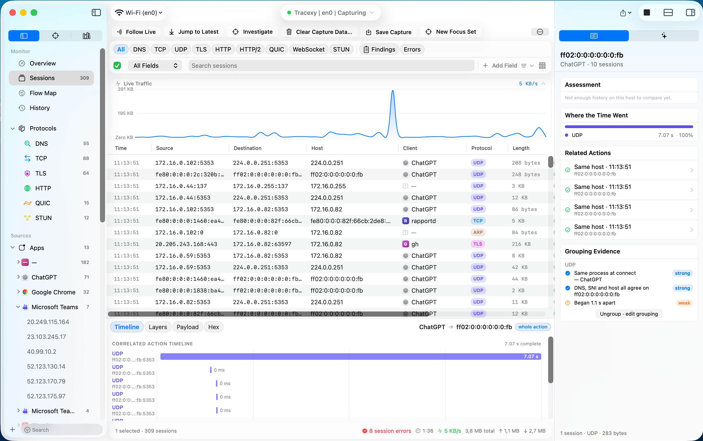
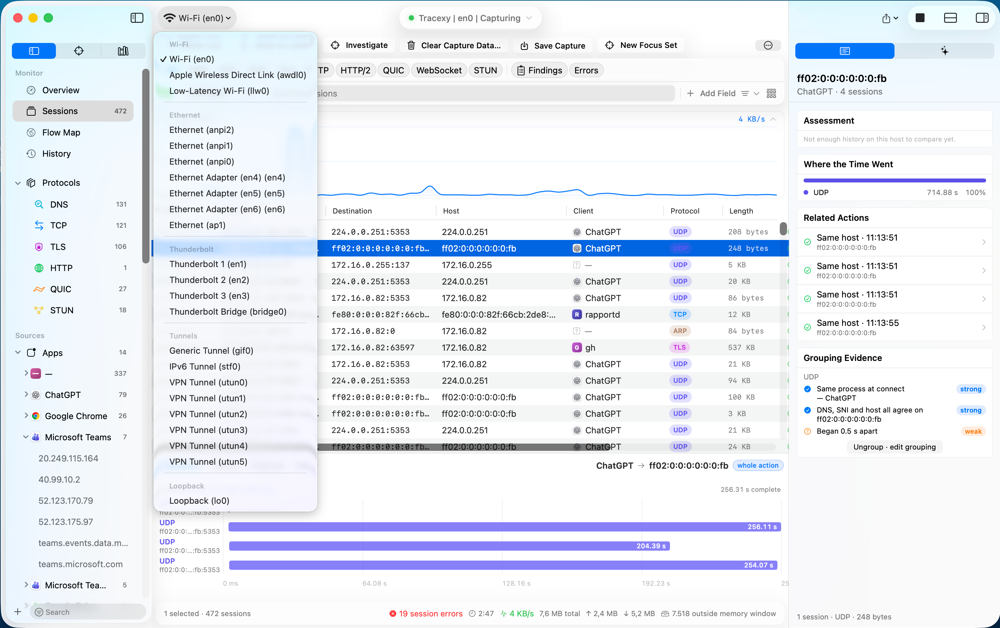
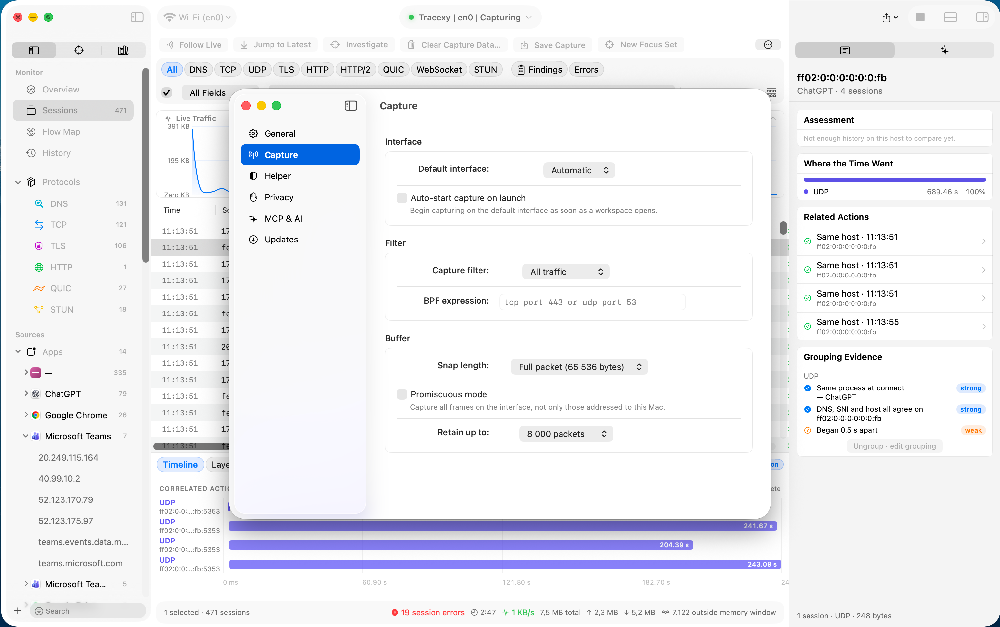

<p align="center">
  
</p>

<h1 align="center">Tracexy</h1>

<p align="center">
  <strong>A native, session-first Wireshark alternative for macOS.</strong>
</p>

<p align="center">
  Native macOS network intelligence, organized around sessions—not packet noise.<br>
  Capture live traffic or open a saved capture, then investigate hosts, processes, protocols,
  timing, and raw packet evidence in one local-first workspace.
</p>

<p align="center">
  <sub>The AGPL-licensed public source edition of Tracexy for macOS.</sub>
</p>

<p align="center">
  <a href="https://github.com/RockxyApp/Tracexy/actions/workflows/build.yml"></a>
  
  
  
  <a href="LICENSE"></a>
  <a href="CONTRIBUTING.md"></a>
</p>

---

<!-- BEGIN GENERATED: latest-release -->
## Latest Tagged Release

**v0.5.0** — 2026-08-24

### Added

- Add local History for completed live and saved captures, with bounded session summaries stored without packet payloads.
- Add typed Investigation queries, evidence-linked findings, and bounded Follow Stream for stopped or saved TCP captures.
- Add Capture Readiness details for the active interface, capture settings, buffering, and observed frame loss.

### Changed

- Stream large saved captures off the main UI path and keep complete live-capture session summaries through disk-backed spooling.
- Refresh the native workspace and Settings with adaptive macOS materials, accessible opaque data surfaces, and responsive window chrome.
- Expand Protocols, Apps, and Domains when the first decoded session arrives while respecting later manual collapse.

See [CHANGELOG.md](CHANGELOG.md) for the full release history.
<!-- END GENERATED: latest-release -->

Tracexy is an open-source network intelligence app built specifically for macOS. It captures traffic
passively and turns frames into explainable sessions and correlated activities: which process
contacted which host, which protocols appeared, how much data moved, and what evidence supports the
grouping.

The main experience is session-first. Raw protocol fields and hex remain one click away when the
bytes are the answer, but they do not dominate the workspace.

> [!IMPORTANT]
> This repository contains Tracexy's public source edition under
> [AGPL-3.0-or-later](LICENSE). Builds made solely from this repository are AGPL builds.
> The official Community DMG is a signed release artifact built from this public source checkout;
> it does not represent a separate closed-source edition or a different license. Third-party
> components remain under their own licenses; see [Licensing](#licensing) below.

## Part of the Rockxy Ecosystem

Tracexy is part of the [Rockxy ecosystem](https://github.com/RockxyApp/Rockxy), a family of native,
local-first tools for understanding and controlling software and network behavior. The products
have distinct jobs and separate repositories, while sharing a focus on transparent evidence,
explicit data boundaries, and native platform experiences:

- **[Rockxy](https://github.com/RockxyApp/Rockxy)** — intercept, inspect, and modify HTTP, HTTPS,
  WebSocket, GraphQL, and other application traffic.
- **Tracexy** — passively capture network traffic and organize it into explainable sessions,
  protocol observations, and evidence-linked investigation workflows.
- **[Shieldxy](https://github.com/RockxyApp/Shieldxy)** — application-aware network security,
  connection control, and policy-oriented visibility.

Tracexy complements the ecosystem rather than replacing any one tool: the application-level
debugger focuses on traffic control, while Tracexy focuses on passive network intelligence across
interfaces, processes, protocols, and session relationships.

## See Tracexy in action

<p align="center">
  <a href="https://rockxy.io/tracexy#demo">
    
  </a>
</p>

<p align="center">
  <em>From live capture to explainable sessions and packet-level evidence.</em>
</p>

<p align="center">
  
</p>
<p align="center"><em>Choose the interface and start from the traffic surface that matters.</em></p>

<p align="center">
  
</p>
<p align="center"><em>Control capture scope, filters, packet detail, and retention before traffic leaves the wire.</em></p>

<p align="center">
  
</p>
<p align="center"><em>Inspect decoded protocol fields alongside the raw bytes that support them.</em></p>


## Why Tracexy

- **Sessions before packets.** Bidirectional traffic is grouped by canonical five-tuple so one
  conversation stays together.
- **Explainable correlation.** Related DNS, TCP, TLS, and HTTP observations can be grouped into an
  activity with visible confidence and contested-attribution states.
- **Native investigation workflow.** The app uses SwiftUI and AppKit for a real macOS sidebar,
  table, toolbar, split views, inspectors, menus, keyboard behavior, and SF Symbols.
- **Evidence stays available.** Summaries lead to decoded layers, field ranges, and raw hex without
  leaving the selected session.
- **Honest unknowns.** Missing process, hostname, protocol, or timing evidence is shown as unknown;
  Tracexy does not manufacture telemetry.
- **Local-first by design.** Captured frames and derived session data stay on the Mac unless the
  user explicitly exports a capture.

## What works today

| Area | Available now |
|---|---|
| **Capture** | Live libpcap capture through a privileged helper; interface discovery; bounded frame buffering; classic PCAP and PCAPNG read/write |
| **Decode** | Ethernet, loopback and tunnel framing; ARP; IPv4/IPv6; ICMP/ICMPv6; TCP/UDP; DNS, TLS, HTTP/1, and QUIC summaries |
| **Sessions** | Direction-normalized five-tuple grouping, byte/timing summaries, bounded TCP lifecycle and sequence evidence, and higher-level activity correlation |
| **Investigation** | Overview, session table, flow map, scoped search, typed queries, evidence-linked findings, bounded Follow Stream, decoded fields, and hex evidence |
| **History** | Local SQLite terminal capture/session summaries with bounded reads, explicit refresh, confirmed clear, and no packet-payload persistence |
| **Automation core** | Read-only one-page History projections with minimum disclosure, deterministic JSON, and spreadsheet-safe RFC-4180 CSV; no executable or network transport |
| **Workspace** | Native sidebar, independent workspace tabs, vertical or bottom inspector layouts, status/footer surfaces, Focus Sets, and Noise Control |
| **Attribution** | Best-effort process ownership from `pktap` metadata with a local socket-to-process fallback |

## Protocol coverage

Application-layer decoding is intentionally metadata-focused in the current implementation. The always-on fold
recovers only bounded initial TLS/HTTP/DNS metadata; an explicit Follow Stream action can rescan a
stable saved or stopped source without turning the capture path into an unbounded stream store.

| Layer | Coverage | Important limits |
|---|---|---|
| **Link / network** | Ethernet II, BSD loopback/null, raw/tunnel IP, ARP, IPv4 options, IPv6 extension headers, ICMP/ICMPv6 | Partial decode is returned for malformed or truncated input |
| **Transport** | TCP flags/options, lifecycle and bounded sequence evidence; UDP endpoints | No general always-on TCP stream/record analyzer |
| **DNS** | Questions, compression pointers, and common answer records including A, AAAA, CNAME, MX, TXT, SRV, and SOA | No DNSSEC analysis |
| **TLS** | Record and handshake metadata, offered/chosen versions, cipher information, SNI, and ALPN | No decryption, certificates, or application data |
| **HTTP/1** | Request-line recognition and the `Host` header | No full headers, response parsing, bodies, chunking, or decompression |
| **QUIC** | Long-header identification on UDP/443 | No frame or payload decode |

See the [source-grounded protocol matrix](docs/protocol-support.md) for exact field coverage.

## Current boundaries

These are deliberate statements of present capability, not hidden roadmap promises:

- No TLS or QUIC decryption.
- No general always-on TCP reassembly or typed record-analyzer framework; connection evidence and explicit bounded Follow Stream are narrower mechanisms.
- No deep HTTP/2, HTTP/3, or WebSocket decoder.
- History persists terminal capture/session summaries, not a raw-packet capture database.
- Findings are selected evidence-linked local observations, not a comprehensive durable security engine.
- A transport-neutral read-only History automation core exists, but there is no CLI target, MCP server, listener, provider, or AI data path.
- Protected `.tracexysession` export enforces payload/metadata protections; raw pcap/pcapng stays byte-preserving. Automatic retention cleanup is not implemented.

## Privacy and security

Network captures can contain credentials, private hostnames, personal messages, and application
payloads. Tracexy treats them as sensitive by default.

- Captured traffic and derived sessions remain local; Tracexy does not upload capture payloads.
- Live capture starts when the user presses **Start**. If the user explicitly enables
  **Auto-start capture on launch**, that preference starts capture when the app opens.
- Opening `.pcap` or `.pcapng` files does not require the privileged helper or administrator access.
- Raw pcap/pcapng export preserves captured bytes and requires acknowledgement while protections are
  enabled. Protected `.tracexysession` export omits raw frames and sensitive decoded metadata according
  to the selected Privacy settings.
- Live capture crosses a narrow, typed XPC boundary with code-signing checks around the privileged
  helper.
- Signed update checks are separate from capture data and never include captured traffic.

Read [Privacy & security](docs/privacy-and-security.md) for the full trust model. Report
vulnerabilities privately through [SECURITY.md](SECURITY.md), not a public issue.

## Quick start

### Requirements

- macOS 14 or later
- Xcode 16 or later
- An Apple Developer Team for code-signing the app and helper

SwiftLint and SwiftFormat are optional for building, but required for contribution checks.

### Get the source

```bash
git clone https://github.com/RockxyApp/Tracexy.git
cd Tracexy
cp Configuration/Developer.xcconfig.template Configuration/Developer.xcconfig
open Tracexy.xcodeproj
```

Set your own Team ID in `Configuration/Developer.xcconfig`:

```text
TRACEXY_TEAM_ID = YOUR_TEAM_ID_HERE
CODE_SIGN_IDENTITY = Apple Development
DEVELOPMENT_TEAM = $(TRACEXY_TEAM_ID)
```

`Developer.xcconfig` is gitignored. Never commit your signing identity, certificates, provisioning
profiles, packet captures, or exported sessions.

Opening a saved capture is the quickest zero-helper path through the decode and session pipeline.
Live capture additionally requires one-time approval for the privileged helper in System Settings.

## Build and validate

```bash
# Build
xcodebuild -project Tracexy.xcodeproj -scheme Tracexy -destination 'platform=macOS' build

# Full app and UI test suite
xcodebuild -project Tracexy.xcodeproj -scheme Tracexy -destination 'platform=macOS' test

# Non-mutating style checks
swiftformat --lint .
swiftlint lint --strict
```

Changes to `TracexyCaptureHelper/` or the shared XPC protocol require uninstalling, rebuilding, and
reinstalling the helper; rebuilding the app alone does not hot-reload the privileged service.

Detailed setup and troubleshooting live in [Getting started](docs/getting-started.md).

## Architecture

```text
Capture  →  Protocol  →  Session  →  Workspace
```

| Layer | Source | Responsibility |
|---|---|---|
| **Capture** | `Tracexy/Core/Capture`, `TracexyCaptureHelper` | Live acquisition, capture-file IO, interface discovery, and capture statistics |
| **Protocol** | `Tracexy/Core/Protocol` | Bounds-checked packet access and stateless per-frame decoding |
| **Session** | `Tracexy/Core/Session` | Canonical conversation grouping, summaries, and activity correlation |
| **Workspace** | `Tracexy/Models`, `Tracexy/ViewModels`, `Tracexy/Views` | App policy, workspace state, orchestration, and native presentation |

The privileged helper exposes typed capture operations rather than arbitrary shell or file access.
Capture files and packet bytes are untrusted input: decoders return partial results or controlled
errors instead of reading beyond available data.

See [Architecture](docs/architecture.md) for the repository map, current seams, and known
transitional debt.

## Documentation

| Guide | Contents |
|---|---|
| [Documentation index](docs/README.md) | Current implementation status and navigation |
| [Getting started](docs/getting-started.md) | Build, signing, helper approval, and validation |
| [Usage](docs/usage.md) | Capture, sessions, correlation, filtering, and inspectors |
| [Architecture](docs/architecture.md) | Data flow, module boundaries, and repository map |
| [Protocol support](docs/protocol-support.md) | Exact decode coverage and limitations |
| [Privacy & security](docs/privacy-and-security.md) | Local-first posture and privileged trust boundary |
| [Changelog](CHANGELOG.md) | Unreleased work and future tagged releases |

## Contributing

Bug reports, tests, documentation fixes, protocol fixtures, and focused pull requests are welcome.
Please read [CONTRIBUTING.md](CONTRIBUTING.md) before submitting a change.

For decoder work, include normal, truncated, and malformed-input coverage. Captures attached to an
issue must be reviewed and redacted first.

## Licensing

### Tracexy source

The source in this repository is licensed under the
[GNU Affero General Public License, version 3 or later (AGPL-3.0-or-later)](LICENSE).
AGPL is a strong copyleft license: you may run, study, modify, and redistribute Tracexy,
including commercially, as long as you follow its conditions.

In practical terms, redistributed modified versions must keep the license and required notices,
identify meaningful changes, and provide the corresponding source under AGPL terms. If a modified
version offers network interaction, AGPL section 13 also requires users who interact with it over
the network to be offered access to the corresponding source. The full legal terms, including the
no-warranty provisions, are in [LICENSE](LICENSE).

A build made solely from this repository is therefore an AGPL build. AGPL does not grant rights to
the Tracexy name, logo, or other trademarks.

### Public source and official Community DMG

The public GitHub repository is the source of truth for Tracexy's Community release channel. The
official DMG published on [GitHub Releases](https://github.com/RockxyApp/Tracexy/releases) is built
from that public checkout using the Release configuration, then:

- signed with a Developer ID certificate and hardened runtime;
- packaged as a drag-to-Applications macOS DMG;
- notarized with Apple's notary service; and
- published with a checksum and a Sparkle signature for the public update feed.

The DMG is therefore an authenticated and notarized distribution of the public AGPL source, not a
closed-source or separately licensed Tracexy binary. A local build from the repository remains
valid under AGPL-3.0-or-later, but it will have its own signing identity, notarization state,
update-feed behavior, and release provenance.

### Third-party and platform components

Tracexy may link to third-party libraries and Apple system components, including the Sparkle update
framework. Those components are not relicensed by this repository and remain subject to their own
license terms and notices. Before distributing a build, review the licenses bundled by Xcode and the
dependency metadata in [`Package.resolved`](Tracexy.xcodeproj/project.xcworkspace/xcshareddata/swiftpm/Package.resolved).
