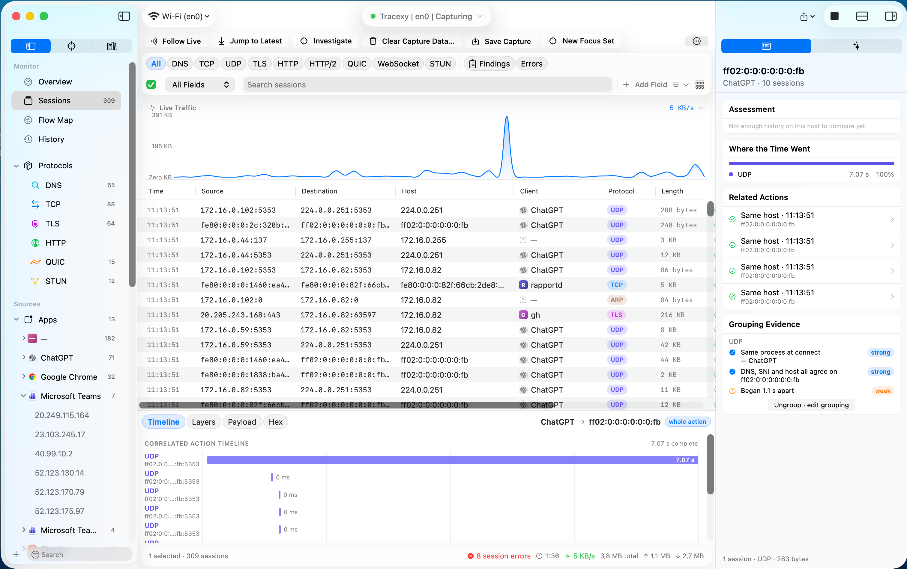
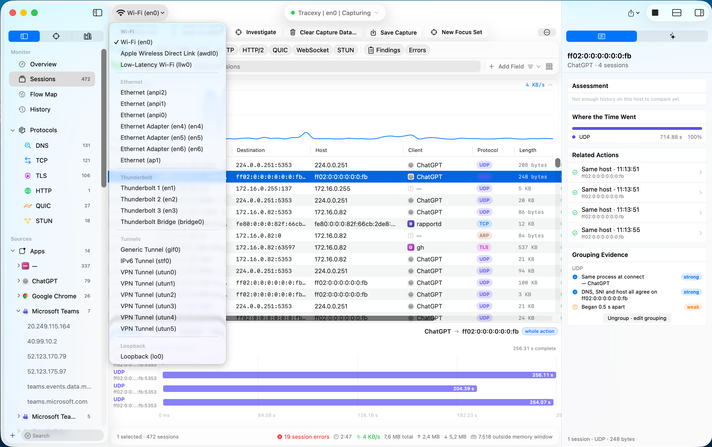
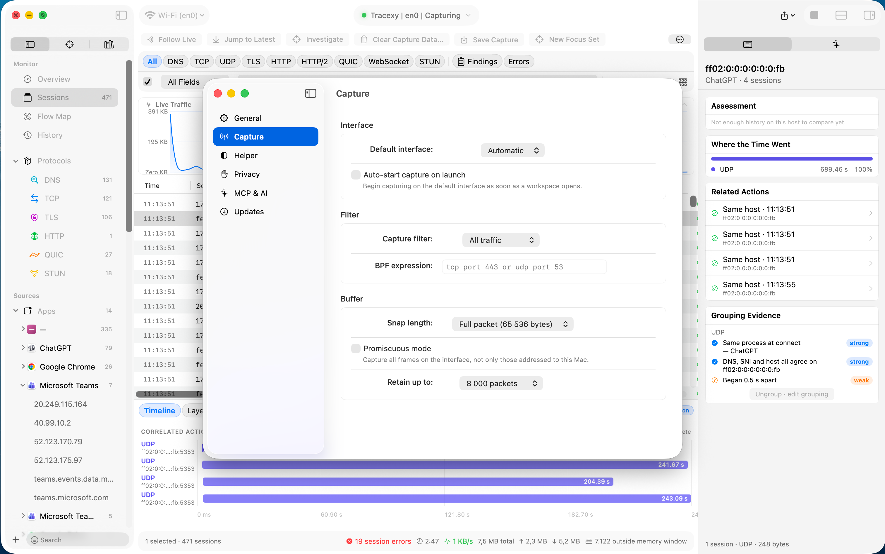
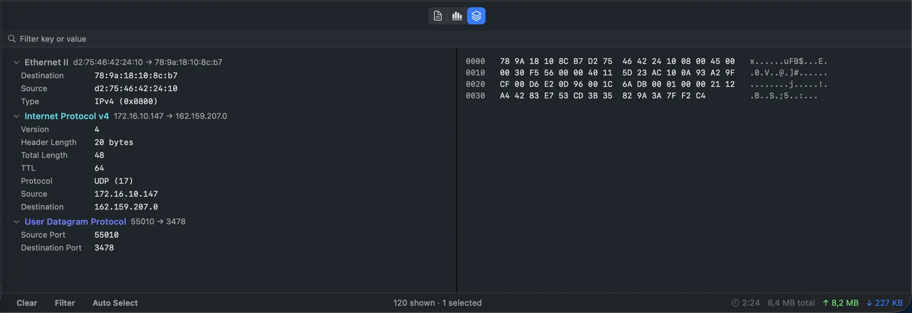

<p align="center">
  
</p>

<h1 align="center">Tracexy</h1>

<p align="center">
  <strong>A native, session-first Wireshark alternative for macOS.</strong>
</p>

<p align="center">
  Native macOS network intelligence, organized around sessions—not packet noise.<br>
  Capture live traffic or open a saved capture, then investigate hosts, processes, protocols,
  timing, and raw packet evidence in one local-first workspace.
</p>

<p align="center">
  <sub>The AGPL-licensed public source edition of Tracexy for macOS.</sub>
</p>

<p align="center">
  <a href="https://github.com/RockxyApp/Tracexy/actions/workflows/build.yml"></a>
  
  
  
  <a href="LICENSE"></a>
  <a href="CONTRIBUTING.md"></a>
</p>

---

<!-- BEGIN GENERATED: latest-release -->
## Latest Tagged Release

**v0.9.0** — 2026-10-08

### Added

- Open several named workspace tabs in one Project. Each keeps its own scope, filters, grouping and panels, and the Project restores them on reopen.
- Investigate sessions with richer expressions, reusable filter buttons and macros, imported display filters, address names, session tags and evidence-linked notes.
- Browse every retained frame, search its text or bytes, inspect decoded fields and packet bytes, validate checksums, add frame comments, and jump between a finding, session and cited frame.
- Follow TCP and UDP conversations with frame citations and visible capture gaps. Read HTTP/1 exchanges, cleartext HTTP/2 including h2c upgrades, and WebSocket messages; save supported streams and HTTP response bodies.
- See response-time measurements, TCP health charts, traffic and field plots, a session ladder, and a flow graph drawn from captured frames.
- Use new Statistics views for conversations, endpoints, protocol hierarchy, DNS, HTTP, IP, packet lengths, service response times, SIP calls and RTP streams, with scoped export where available.
- Find evidence-linked TCP, DNS, TLS and ICMP problems, including unanswered handshakes, flow-control issues and cleartext credentials, with explicit unknown states when evidence is incomplete.
- Decode fragmented IPv4 and IPv6 datagrams, GRE and VXLAN tunnels, and more local, enterprise and media protocols including mDNS, DHCP, NTP, SIP/RTP, SMB, LDAP, Kerberos and TFTP.
- Add a local MaxMind-format GeoIP database to a Project for optional endpoint and session location context; private and special addresses are not looked up.
- Manage capture interfaces, validate and save BPF filters, choose per-interface optimization, stop automatically by time or packet count, and rotate long live captures into bounded files.
- Merge or split capture files, open LZ4-compressed captures and named-pipe input, inspect file structure, and export selected frames with optional address masking, notes and comments.
- Export bounded HTTP, SMB, email, FTP and certificate objects, packet dissections and application PDUs from captured evidence.
- Use the command line to inspect captures, sessions, frames, statistics and supported objects, and let an explicitly granted read-only MCP client list findings from History.
- Use the native interface in Vietnamese.

### Fixed

- RTP Stream Analysis handles out-of-range timestamps without crashing, computes off the main thread, and keeps both directions on one graph time axis.
- SMB Export Objects finds files across real share and handle lifecycles. Save All continues past individual failures and gives colliding file names unique destinations.
- Switching Projects refreshes capture-backed report windows, and early-opened Endpoints and Inspector views load their location context.
- Large Project catalogs and captures no longer stall routine saves or investigation views; over-limit saved data stays readable and editable while new additions remain gated.
- Project imports, tab actions, filter buttons and macros enforce capacity at the final write and preserve stored values this version cannot read.
- Cleartext HTTP/2 and WebSocket filters match their sessions; HTTP/1 requests with binary bodies and HTTP/2 prefaces sharing a segment remain readable.
- Auxiliary window controls, narrow inspector layouts, session selection and cited-frame navigation remain usable across window and accessibility transitions.
- PCAPNG TLS key-log blocks and equal-count statistics rows display correctly.

### Changed

- Export Objects and Export PDUs scan many connections in grouped passes, reducing repeated reads of large captures.
- Quitting during live capture now stops capture cleanly and retains session History; captured packets still require an explicit save.
- Session, finding, inspector and status text uses clearer plain-language descriptions and keeps unknown or missing evidence explicit.

See [CHANGELOG.md](CHANGELOG.md) for the full release history.
<!-- END GENERATED: latest-release -->

Tracexy is an open-source network intelligence app built specifically for macOS. It captures traffic
passively and turns frames into explainable sessions and correlated activities: which process
contacted which host, which protocols appeared, how much data moved, and what evidence supports the
grouping.

The main experience is session-first. Raw protocol fields and hex remain one click away when the
bytes are the answer, but they do not dominate the workspace.

> [!IMPORTANT]
> This repository contains Tracexy's public source edition under
> [AGPL-3.0-or-later](LICENSE). Builds made solely from this repository are AGPL builds.
> Rockxy LLC may also offer official binaries, support, enterprise rights, hosted services, or
> downstream distributions under separate commercial terms. Those terms apply only to the copy,
> service, or distribution that presents them; they do not remove the AGPL rights granted for this
> public source edition. Third-party components remain under their own licenses; see
> [Licensing](#licensing) below.

## Part of the Rockxy Ecosystem

Tracexy is part of the [Rockxy ecosystem](https://github.com/RockxyApp/Rockxy), a family of native,
local-first tools for understanding and controlling software and network behavior. The products
have distinct jobs and separate repositories, while sharing a focus on transparent evidence,
explicit data boundaries, and native platform experiences:

- **[Rockxy](https://github.com/RockxyApp/Rockxy)** — intercept, inspect, and modify HTTP, HTTPS,
  WebSocket, GraphQL, and other application traffic.
- **Tracexy** — passively capture network traffic and organize it into explainable sessions,
  protocol observations, and evidence-linked investigation workflows.
- **[Shieldxy](https://github.com/RockxyApp/Shieldxy)** — application-aware network security,
  connection control, and policy-oriented visibility.

Tracexy complements the ecosystem rather than replacing any one tool: the application-level
debugger focuses on traffic control, while Tracexy focuses on passive network intelligence across
interfaces, processes, protocols, and session relationships.

## See Tracexy in action

<p align="center">
  <a href="https://rockxy.io/tracexy#demo">
    
  </a>
</p>

<p align="center">
  <em>From live capture to explainable sessions and packet-level evidence.</em>
</p>

<p align="center">
  
</p>
<p align="center"><em>Choose the interface and start from the traffic surface that matters.</em></p>

<p align="center">
  
</p>
<p align="center"><em>Control capture scope, filters, packet detail, and retention before traffic leaves the wire.</em></p>

<p align="center">
  
</p>
<p align="center"><em>Inspect decoded protocol fields alongside the raw bytes that support them.</em></p>


## Why Tracexy

- **Sessions before packets.** Bidirectional traffic is grouped by canonical five-tuple so one
  conversation stays together.
- **Explainable correlation.** Related DNS, TCP, TLS, and HTTP observations can be grouped into an
  activity with visible confidence and contested-attribution states.
- **Native investigation workflow.** The app uses SwiftUI and AppKit for a real macOS sidebar,
  table, toolbar, split views, inspectors, menus, keyboard behavior, and SF Symbols.
- **Isolated Projects.** Keep separate investigations with their own workspaces, saved captures,
  History, filters, and capture and privacy settings.
- **Evidence stays available.** Summaries lead to decoded layers, field ranges, and raw hex without
  leaving the selected session.
- **Honest unknowns.** Missing process, hostname, protocol, or timing evidence is shown as unknown;
  Tracexy does not manufacture telemetry.
- **Local-first by design.** Captured frames and derived session data stay on the Mac unless the
  user explicitly exports a capture.

## What works today

| Area | Available now |
|---|---|
| **Capture** | Live libpcap capture through a privileged helper; interface discovery; bounded frame buffering; autostop and file-set (rotating) capture; PCAP/PCAPNG read/write; managed gzip, LZ4, TCP Viewer archive, and Linux cooked capture import; merge, split, and address-replacing export |
| **Decode** | Ethernet (VLAN), loopback, GRE/VXLAN and tunnel framing; ARP; IPv4/IPv6; ICMP/ICMPv6; TCP/UDP; DNS/mDNS, DHCP, NTP, TLS, HTTP/1 requests and responses, STUN, and QUIC summaries |
| **Sessions** | Direction-normalized five-tuple grouping, byte/timing summaries, bounded TCP lifecycle and sequence evidence, and higher-level activity correlation |
| **Investigation** | Overview, session table, flow map, scoped search, Session Expressions, evidence-linked findings, ladder and TCP health charts, response times, bounded Follow Stream, Protocol Hierarchy, DNS Lookups (with encrypted-DNS recognition), Message Counts, decoded fields, hex evidence, notes, and tags |
| **History** | Local SQLite terminal capture/session summaries with bounded reads, explicit refresh, confirmed clear, and no packet-payload persistence |
| **Automation** | Read-only History projections (captures, sessions, findings) with minimum disclosure; a bundled read-only MCP stdio tool; a read-only `summary` / `sessions` / `findings` command line built into the app binary; no network listener |
| **Workspace** | Native sidebar, independent workspace tabs, vertical or bottom inspector layouts, status/footer surfaces, Focus Sets, and Noise Control |
| **Projects** | Isolated investigations with separate workspaces, saved-capture Library, History, capture/privacy settings, and configuration-only import/export |
| **Attribution** | Best-effort process ownership from `pktap` metadata with a local socket-to-process fallback |
| **Languages** | English and Vietnamese |

## Comparison at a glance

Tracexy is not a Wireshark clone or a TLS interception proxy. It is strongest when a Mac
investigation needs app-aware sessions, local packet evidence, and a support-ready handoff without
claiming decrypted HTTPS visibility. The full maintained matrix is in
[docs/comparison.md](docs/comparison.md).

| Decision point | Tracexy | Wireshark | tcpdump | TShark | Packet | Cocoa Packet Analyzer |
|---|---|---|---|---|---|---|
| **Primary workflow** | Native macOS, session-first packet evidence with app/process context | Deep protocol dissection and broad packet-analysis workflow | Small command-line capture primitive | Wireshark dissection and field output in a terminal | Friendly native Mac traffic view | Native Mac packet/trace analyzer |
| **Source/license posture** | AGPL-3.0-or-later public source; separate commercial terms may exist for official distributions | Public open-source project | Public open-source command-line tool | Public open-source Wireshark command-line tool | closed source or no public information | closed source or no public information |
| **Live capture** | Live libpcap capture through a narrow privileged helper | Live interface capture | Live interface capture from terminal | Live capture from terminal | Native Mac live traffic workflow, depth requires vendor verification | Capture workflow requires vendor verification |
| **App/process attribution** | Core workflow when macOS context is available; unknown stays unknown | Possible through capture context, not the central workflow | Depends on capture context and surrounding tools | Available only if fields/capture context expose it | Per-app usage is publicly positioned, implementation depth requires vendor verification | Not a central verified claim |
| **TLS and HTTPS payloads** | TLS metadata only; no TLS interception, no decryption, no encrypted HTTP body visibility | Packet visibility depends on keys, capture point, and protocol conditions | Captures bytes; no HTTP interception workflow | Same packet-analysis boundary as Wireshark | Not positioned as an HTTPS interception proxy | Packet-analyzer boundary; no verified HTTPS interception claim |
| **Best aligned user** | Mac developer/support/security workflow that needs app-aware packet evidence without decrypting traffic | Protocol engineer or analyst needing maximum dissector depth | Operator collecting traffic quickly on a terminal or remote system | Analyst automating Wireshark-style dissection | Mac user wanting a friendly traffic view | Mac user wanting a native packet/trace analyzer |

## Protocol coverage

Application-layer decoding is intentionally metadata-focused in the current implementation. The always-on fold
recovers only bounded initial TLS/HTTP/DNS metadata; an explicit Follow Stream action can rescan a
stable saved or stopped source without turning the capture path into an unbounded stream store.

| Layer | Coverage | Important limits |
|---|---|---|
| **Link / network** | Ethernet II, BSD loopback/null, raw/tunnel IP, ARP, IPv4 options, IPv6 extension headers, ICMP/ICMPv6 | Partial decode is returned for malformed or truncated input |
| **Transport** | TCP flags/options, lifecycle and bounded sequence evidence; UDP endpoints | No general always-on TCP stream/record analyzer |
| **DNS** | Questions, compression pointers, and common answer records including A, AAAA, CNAME, MX, TXT, SRV, and SOA | No DNSSEC analysis |
| **TLS** | Record and handshake metadata, offered/chosen versions, cipher information, SNI, and ALPN | No decryption, certificates, or application data |
| **HTTP/1** | Request line and `Host`; response status and the headers that explain it (credentials only named as present); on-demand request↔response pairing, timing and body saving in Follow Stream | No HTTP/2 or HTTP/3; bodies only on demand from a stable source, never decompressed |
| **QUIC** | Long-header identification on UDP/443 | No frame or payload decode |

See the [source-grounded protocol matrix](docs/protocol-support.md) for exact field coverage.

## Current boundaries

These are deliberate statements of present capability, not hidden roadmap promises:

- No TLS or QUIC decryption.
- No general always-on TCP reassembly or typed record-analyzer framework; connection evidence and explicit bounded Follow Stream are narrower mechanisms.
- No deep HTTP/2, HTTP/3, or WebSocket decoder.
- History persists terminal capture/session summaries, not a raw-packet capture database.
- Findings are selected evidence-linked local observations, not a comprehensive durable security engine.
- A free, read-only MCP stdio executable exposes four bounded History tools (captures, sessions, findings) for one explicitly granted Project; it opens no listener and exposes no capture control or raw frames.
- The in-app AI Assistant sends a reviewed, bounded selected-session brief only to a validated local model endpoint. Remote/BYOK providers are not implemented in this Community checkout.
- Protected `.tracexysession` export enforces payload/metadata protections; raw pcap/pcapng stays byte-preserving. History retention is boundary-triggered rather than a periodic background scheduler.

## Privacy and security

Network captures can contain credentials, private hostnames, personal messages, and application
payloads. Tracexy treats them as sensitive by default.

- Captured traffic and derived sessions remain local; Tracexy does not upload capture payloads.
- Live capture starts when the user presses **Start**. If the user explicitly enables
  **Auto-start capture on launch**, that preference starts capture when the app opens.
- Opening `.pcap` or `.pcapng` files does not require the privileged helper or administrator access.
- Raw pcap/pcapng export preserves captured bytes and requires acknowledgement while protections are
  enabled. Protected `.tracexysession` export omits raw frames and sensitive decoded metadata according
  to the selected Privacy settings.
- Live capture crosses a narrow, typed XPC boundary with code-signing checks around the privileged
  helper.
- Signed update checks are separate from capture data and never include captured traffic.

Read [Privacy & security](docs/privacy-and-security.md) for the full trust model. Report
vulnerabilities privately through [SECURITY.md](SECURITY.md), not a public issue.

## Quick start

### Requirements

- macOS 14 or later
- Xcode 16 or later
- An Apple Developer Team for code-signing the app and helper

SwiftLint and SwiftFormat are optional for building, but required for contribution checks.

### Get the source

```bash
git clone https://github.com/RockxyApp/Tracexy.git
cd Tracexy
cp Configuration/Developer.xcconfig.template Configuration/Developer.xcconfig
open Tracexy.xcodeproj
```

Set your own Team ID in `Configuration/Developer.xcconfig`:

```text
TRACEXY_TEAM_ID = YOUR_TEAM_ID_HERE
CODE_SIGN_IDENTITY = Apple Development
DEVELOPMENT_TEAM = $(TRACEXY_TEAM_ID)
```

`Developer.xcconfig` is gitignored. Never commit your signing identity, certificates, provisioning
profiles, packet captures, or exported sessions.

Opening a saved capture is the quickest zero-helper path through the decode and session pipeline.
Live capture additionally requires one-time approval for the privileged helper in System Settings.

## Build and validate

```bash
# Build
xcodebuild -project Tracexy.xcodeproj -scheme Tracexy -destination 'platform=macOS' build

# Full app and UI test suite
xcodebuild -project Tracexy.xcodeproj -scheme Tracexy -destination 'platform=macOS' test

# Non-mutating style checks
swiftformat --lint .
swiftlint lint --strict
```

Changes to `TracexyCaptureHelper/` or the shared XPC protocol require uninstalling, rebuilding, and
reinstalling the helper; rebuilding the app alone does not hot-reload the privileged service.

Detailed setup and troubleshooting live in [Getting started](docs/getting-started.md).

## Architecture

```text
Capture  →  Protocol  →  Session  →  Workspace
```

| Layer | Source | Responsibility |
|---|---|---|
| **Capture** | `Tracexy/Core/Capture`, `TracexyCaptureHelper` | Live acquisition, capture-file IO, interface discovery, and capture statistics |
| **Protocol** | `Tracexy/Core/Protocol` | Bounds-checked packet access and stateless per-frame decoding |
| **Session** | `Tracexy/Core/Session` | Canonical conversation grouping, summaries, and activity correlation |
| **Workspace** | `Tracexy/Models`, `Tracexy/ViewModels`, `Tracexy/Views` | App policy, workspace state, orchestration, and native presentation |

The privileged helper exposes typed capture operations rather than arbitrary shell or file access.
Capture files and packet bytes are untrusted input: decoders return partial results or controlled
errors instead of reading beyond available data.

See [Architecture](docs/architecture.md) for the repository map, current seams, and known
transitional debt.

## Documentation

| Guide | Contents |
|---|---|
| [Documentation index](docs/README.md) | Current implementation status and navigation |
| [Getting started](docs/getting-started.md) | Build, signing, helper approval, and validation |
| [Usage](docs/usage.md) | Capture, sessions, correlation, filtering, and inspectors |
| [Architecture](docs/architecture.md) | Data flow, module boundaries, and repository map |
| [Protocol support](docs/protocol-support.md) | Exact decode coverage and limitations |
| [Privacy & security](docs/privacy-and-security.md) | Local-first posture and privileged trust boundary |
| [Competitor comparison](docs/comparison.md) | Source-backed positioning against packet-analysis alternatives |
| [Changelog](CHANGELOG.md) | Unreleased work and future tagged releases |

## Contributing

Bug reports, tests, documentation fixes, protocol fixtures, and focused pull requests are welcome.
Please read [CONTRIBUTING.md](CONTRIBUTING.md) before submitting a change.

For decoder work, include normal, truncated, and malformed-input coverage. Captures attached to an
issue must be reviewed and redacted first.

## Licensing

### Tracexy source

The source in this repository is licensed under the
[GNU Affero General Public License, version 3 or later (AGPL-3.0-or-later)](LICENSE).
AGPL is a strong copyleft license: you may run, study, modify, and redistribute Tracexy,
including commercially, as long as you follow its conditions.

In practical terms, redistributed modified versions must keep the license and required notices,
identify meaningful changes, and provide the corresponding source under AGPL terms. If a modified
version offers network interaction, AGPL section 13 also requires users who interact with it over
the network to be offered access to the corresponding source. The full legal terms, including the
no-warranty provisions, are in [LICENSE](LICENSE).

A build made solely from this repository is therefore an AGPL build. AGPL does not grant rights to
the Tracexy name, logo, or other trademarks.

### Commercial licensing and official binaries

Rockxy LLC may offer Tracexy, official binaries, support, enterprise rights, hosted services, private
distribution rights, or downstream distributions under separate commercial terms. See the
[Commercial Licensing Policy](legal/COMMERCIAL-LICENSING.md) and the draft
[Binary EULA](legal/BINARY-EULA-v1.0.md).

A commercial license applies only when Rockxy LLC grants it in writing or when an official
distribution presents the applicable agreement. Owning or using a commercially licensed copy does
not cancel the AGPL rights you have for a separate copy of the public source edition.

External contributions are accepted under the
[Tracexy Individual Contributor License Agreement](legal/cla/ICLA-v1.0.md) so accepted changes can
remain available in the public AGPL edition and also be used in separately licensed Tracexy
distributions. Organization-owned contributions require the
[Corporate Contributor License Agreement](legal/cla/CCLA-v1.0.md).

AGPL does not grant rights to use the Tracexy or Rockxy LLC names, logos, icons, domains, trade
dress, or other trademarks to identify a modified or redistributed product, except for truthful
nominative reference permitted by law.

### Third-party and platform components

Tracexy may link to third-party libraries and Apple system components, including the Sparkle update
framework. Those components are not relicensed by this repository and remain subject to their own
license terms and notices. Before distributing a build, review the licenses bundled by Xcode and the
dependency metadata in [`Package.resolved`](Tracexy.xcodeproj/project.xcworkspace/xcshareddata/swiftpm/Package.resolved).
